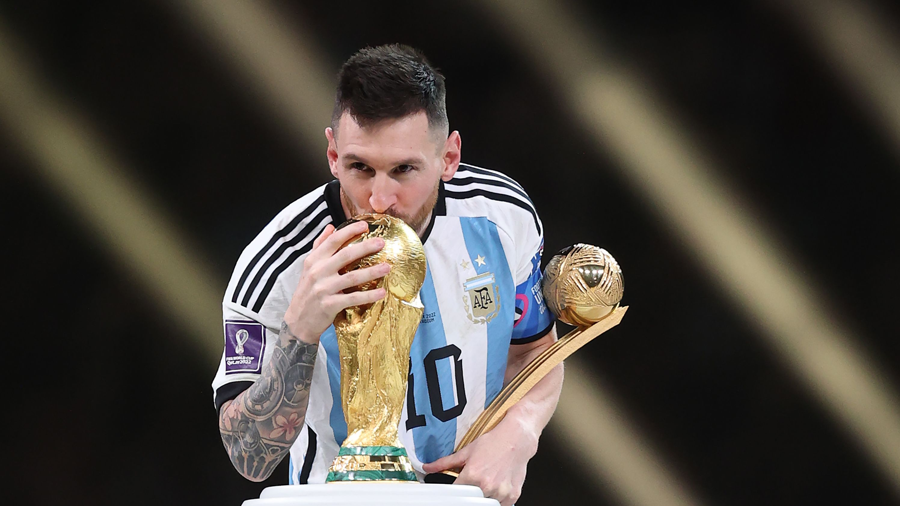

```{r setup, include=FALSE}
knitr::opts_chunk$set(echo = TRUE)
```

# About This Project

As the 2022/2023 season approaches its conclusion, it has been confirmed that Lionel Messi will be leaving Paris Saint-Germain (PSG) and has yet to decide on his next club for the 2023/2024 season. Excitingly, there are rumors circulating that Messi might make a return to his beloved home club, FC Barcelona. As an ardent FC Barcelona fan, witnessing Messi donning the blaugrana shirt once again before his retirement would be a dream come true. This project aims to utilize data spanning from 05/01/2005 to 04/03/2023 to delve into Messi's illustrious career and determine the potential impact he could have on Barcelona FC if he were to return.
<br>
<br>

<br>
<br>
Data :

1. [Barcelona](https://www.kaggle.com/datasets/azminetoushikwasi/-lionel-messi-all-club-goals) <br>
<!-- 2. [PSG](https://www.kaggle.com/datasets/davidcariboo/player-scores?resource=download) -->

## Background

Lionel Andrés Messi is an Argentine professional footballer, and with the World Cup 2022 vicotry, he is regarded as one of the greatest players in the history of the sport. He was born on June 24, 1987, in Rosario, Argentina.

Messi's career took off when he joined the youth academy of FC Barcelona, La Masia, at the age of 13. He quickly progressed through the ranks and made his first-team debut for Barcelona in 2004 at the age of 17. Since then, Messi has become synonymous with Barcelona and has spent the majority of his professional career with the club.

During his time at Barcelona, Messi achieved remarkable success, helping the team win numerous domestic and international titles. He played a pivotal role in Barcelona's golden era under coach Pep Guardiola, where they won multiple La Liga titles and the UEFA Champions League.

In August 2021, Messi left Barcelona due to financial constraints faced by the club. He joined Paris Saint-Germain (PSG) in France, where he continued to showcase his brilliance on the field. However, rumors have circulated that Messi might return to Barcelona for the 2023/2024 season, which has generated excitement among Barcelona fans and football enthusiasts worldwide.

As Messi ponders his next move in the football world, fans eagerly await his decision and the possibility of witnessing him return to Barcelona, where he made an indelible mark on the club's history.

### Analysis

```{r library, include = FALSE}
library(dplyr)
library(ggplot2)
library(stringr)
```

```{r reading data, echo= FALSE}
# Importing data
messi <- read.csv('data.csv')
```

``` {r preprocessing, echo = FALSE}
# ******************************************************************************
# Data from 
# https://www.kaggle.com/datasets/azminetoushikwasi/-lionel-messi-all-club-goals
# ******************************************************************************

# Change season to the same format
messi <- messi %>%
  mutate(Season = ifelse (Season == "11-Dec","11/12",
                          ifelse (Season == "Dec-13","12/13", Season)))

# Competitions
messi <- messi %>%
  mutate(Competition = ifelse(Competition == "Troph�e des Champions", "Trophée des Champions",
                              ifelse(Competition == "Champions League", "UEFA Champions League",
                                     Competition)))

# Date
messi <- messi %>% 
  mutate (Date = gsub("-","/",Date)) %>%
  mutate (date = as.Date(Date, format = "%m/%d/%y"))

# Scoring types
messi <- messi %>%
  mutate (Type = ifelse (Type == "","Right-footed shot",Type))

# Playing position
messi <- messi %>%
  mutate(position = ifelse(Playing_Position == "AM ", "AM",
                           ifelse(Playing_Position == "CF ", "CF",
                                  ifelse(Playing_Position == "RW ", "RW",
                                         ifelse(Playing_Position == "SS ", "SS",Playing_Position)))))
# Converting minute to numeric
messi_1 <- messi %>%
  mutate(numeric_part = str_extract(Minute, "\\d+")) %>%
  # Extract additional time
  mutate(additional_time = str_extract(Minute, "\\+(\\d+)")) %>%
  # Convert to numeric
  mutate(numeric_part = as.numeric(numeric_part)) %>%
  mutate(additional_time = as.numeric(additional_time)) %>%
  mutate(minute_score = numeric_part + additional_time) %>%
  # Calculate total minutes
  mutate(minute_score = ifelse(is.na(minute_score),numeric_part,minute_score))

# messi <- messi_1 %>%
#   # filter (Club == "Paris Saint-Germain")
#   filter (Club == "FC Barcelona")
```

#### **Summary Statistics**

```{r summary statistics}
head(messi)
str(messi)
summary(messi)
```
<br>

#### **Messi's Preferred Positions and Scoring Type**

``` {r Position, echo = FALSE,fig.width = 6, fig.height= 5}
# Messi's position
messi_position <- messi %>%
  group_by(position) %>%
  count(position) %>%
  ungroup() %>%
  mutate(total = sum(n)) %>%
  mutate(percentage = round(n / total * 100,2)) %>%
  arrange(desc(percentage))

# Plotting Messi's position
ggplot(messi_position, aes(x = reorder(position,-percentage), y = percentage, fill = position)) +
  geom_bar(stat = "identity") +
  labs(x = "Position", y = "Number of Goals", title = "Figure 1: Messi's Playing Position", position = "center") +
  scale_fill_manual(values = c("#FFC300", "#FF5733", "#C70039", "#900C3F", "#581845")) +
  geom_text(aes(label = n),check_overlap = TRUE, size = 3, vjust = -.5,position = "identity")+
  guides(fill = "none")+
  theme_minimal()
``` 

```{r scoring type, echo = FALSE,fig.width = 6, fig.height= 5}
# Messi's Scoring type
messi_scoring_type <- messi %>%
  group_by(Type) %>%
  count(Type) %>%
   ungroup %>%
  mutate(total = sum(n)) %>% 
  mutate (percentage = round(n/total *100,2)) %>%
  arrange(desc(percentage))

# Messi's scoring types
ggplot(messi_scoring_type, aes(x = reorder(Type, -percentage), y = percentage, fill = Type)) +
  geom_bar(stat = "identity") +
  labs(x = "Scoring Type", y = "Number of Goals", title = "Figure 2: Messi's Scoring Types") +
  scale_fill_manual(values = c("#FFC300", "#FF5733", "#C70039", "#900C3F", "#581845", "#800000", "#FF0000", "#FF4500", "#FF8C00", "#FFA500", "#FFD700", "#FFFF00")) +
  theme_minimal() +
  theme(axis.text.x = element_text(angle = 45, hjust = 1)) +
  geom_text(aes(label = n),check_overlap = TRUE, size = 3, vjust = -.5,position = "identity")+

  guides(fill = "none")
``` 

**Figure 1** illustrates Lionel Messi's preferred positions in football. According to the data, his favorite positions are central forward (`r messi_position$position[1]`) and right wing (`r messi_position$position[2]`). He has scored `r messi_position$n[1]` goals as a `r messi_position$position[1]` and `r messi_position$n[2]` goals as a `r messi_position$position[2]`. However, Messi has also displayed his versatility by playing in other positions, including second striker (`r messi_position$position[3]`): `r messi_position$n[3]` goals, attacking midfielder (`r messi_position$position[4]`): `r messi_position$n[4]` goals, and left wing (`r messi_position$position[5]`): `r messi_position$n[5]` goals.
<br>
<br>
On the other hand, **Figure 2** provides insights into the types of goals Messi has scored throughout his career. The majority of his goals (`r messi_scoring_type$n[1]`) have been scored using his left foot, which is expected as he is predominantly left-footed. This dominance in left-footed goals is represented by the `r messi_scoring_type$Type[1]` category. However, it is worth noting that Messi has also demonstrated his ability to score using other methods, as depicted in **Figure 2** 
<br>
<br>

#### **Messi's Goal Scoring Record & Impact**

``` {r goal by season, echo = FALSE,fig.width = 6, fig.height= 5}
# Goal by Season
goal_by_season <- messi %>%
  group_by(Season) %>%
  count(Season)


# Goal by season
ggplot(goal_by_season, aes(x = Season, y = n , fill = Season)) +
  geom_bar(stat = "identity")+
  labs(x = "Season", y = "Number of Goals", title = "Figure 3: Messi's Goals by Season") +
  theme_minimal() +
  theme(axis.text.x = element_text(angle = 45, hjust = 1)) +  
  geom_text(aes(label = n),check_overlap = TRUE, size = 3, vjust = -.5,position = "identity")+
  guides(fill = "none")+
  geom_hline(yintercept =30, col= "blue")+
  geom_vline(xintercept = 17.5,col= "red")
```

``` {r Competition, echo = FALSE,fig.width = 6, fig.height= 5}
# Goal by competition
goal_by_comp <- messi %>%
  group_by(Competition) %>%
  count(Competition) %>% 
  arrange(desc(n))
# Goals by competition
ggplot(goal_by_comp, aes(x = reorder(Competition,-n), y = n, fill = Competition)) +
  geom_bar(stat = "identity")+
  labs(x ="Competitions",y="Number of Goals", title= "Figure 4: Messi's Goals by Competition")+
  theme_minimal()+
  theme(axis.text.x = element_text(angle = 45, hjust = 1))+
  geom_text(aes(label = n),check_overlap = TRUE,vjust = -.5, size = 3, position = "identity") +
  guides(fill = "none")
```
<br>
<br>
As mentioned in the Background, Messi started his first team debut in 2004 so it is not surprised that he only scored 1 goal. However, as time progress, he has made significant impact to the team scoring more than 30 goals consecutively since `r goal_by_season$Season[5]` season as shown in **Figure 3** before moving to PSG (indicated by vertical red line). He also holds the record for the most goals scored in `r goal_by_comp$Competition[1]` with `r goal_by_comp$n[1]` goals, **Figure 4**. Beside the domestic league,La Liga and Ligue 1, **Figure 4** also shows the importance of Messi to the team scoring in other competitions.

```{r goals by match,echo = FALSE,fig.width = 10, fig.height= 5}
import_match_goal <- messi %>%
  filter(!Competition %in% c("LaLiga", "Ligue 1")) %>%
  group_by(Competition, Matchday) %>%
  count(Matchday) %>%
  arrange(Competition,Matchday)

ggplot(import_match_goal, aes( x = Matchday, y = n,fill = Competition))+
  geom_bar(stat = "identity")+
  labs(x = "Matchday", y = "Number of Goals", title = "Figure 5: Goals Besides Laliga and Ligue 1") + 
  theme_minimal()+
  theme(axis.text.x = element_text(angle = 45, hjust = 1)) 
```
<br>
<br>
To further dissect his goal-scoring ability, **Figure 5** indicates that Messi has contributed to the team's success in various competitions other than the domestic leagues. These competitions differ from the domestic league in the sense that they are bracketed, meaning that each goal becomes even more vital to the team's advancement to different stages.
<br>
<br>

#### **Goals Against Top 10 Teams**

``` {r victims, echo = FALSE,fig.width = 6, fig.height= 5}
# Favorite victims
top_10_opponents <- messi %>%
  group_by(Opponent) %>%
  count(Opponent) %>% 
  arrange(desc(n)) %>%
  head(10)

# Goals against top 10 clubs
top_club <- c("Real Madrid", "Bayern Munich", "Manchester United", "Liverpool FC",
              "Juventus FC", "Paris Saint-Germain","Manchester City","Atletico de Madrid",  
              "AC Milan", "Chelsea FC")
goal_top_opponent <- messi %>% 
  filter(Opponent %in% top_club) %>%
  group_by(Opponent) %>%
  count(Opponent) %>%
  arrange(desc(n))

ggplot(goal_top_opponent, aes(x = Opponent, y = n, fill = Opponent))+
  geom_bar(stat = 'identity')+
  labs(x = "Teams", y = "Number of Goals", title = "Figure 6: Goals Against Top 10 Teams") + 
  theme_minimal()+
  theme(axis.text.x = element_text(angle = 45, hjust = 1)) +
  guides(fill = 'none')+
  geom_text(aes(label = n),check_overlap = TRUE,vjust = -.5, size = 3,
            position = "identity") 
```
<br>
Messi has consistently performed at the highest level against top clubs. **Figure 6** showcases his goals against the top 10 teams, including `r goal_top_opponent$Opponent[1:10]`. The figure provides insight into Messi's ability to rise to the occasion and score against formidable opponents.
<br>

#### **Goal Distribution by Time**

``` {r goal dist, echo = FALSE,fig.width = 6, fig.height= 5}
# Converting minute to numeric
messi <- messi %>%
  mutate(numeric_part = str_extract(Minute, "\\d+")) %>%
# Extract additional time
  mutate(additional_time = str_extract(Minute, "\\+(\\d+)")) %>%
# Convert to numeric
  mutate(numeric_part = as.numeric(numeric_part)) %>%
  mutate(additional_time = as.numeric(additional_time)) %>%
  mutate(minute_score = numeric_part + additional_time) %>%
  # Calculate total minutes
  mutate(minute_score = ifelse(is.na(minute_score),numeric_part,minute_score))
# Goal by minute
messi$ goal_time <- ifelse(messi$numeric_part <= 45 & is.na(messi$additional_time), "First Half",
                  ifelse(messi$numeric_part <= 90 & is.na(messi$additional_time), "Second Half",
                         "Extra Time"))

# Calculate the count of goals for each goal time category
goal_distribution <- table(messi$goal_time)

# Create a data frame from the count results
goal_distribution <- data.frame(goal_time = names(goal_distribution),
                           count = as.numeric(goal_distribution),
                           percent = as.numeric(goal_distribution) / sum(as.numeric(goal_distribution)) * 100)
# Create a bar plot to visualize the goal distribution

pie(goal_distribution$percent, labels = paste(goal_distribution$goal_time,":", round(goal_distribution$percent,2),"%"), col = c("blue", "green", "red"), main = "Figure 7: Goal Distribution by Time")
```
<br>
**Figure 7** displays the distribution of Messi's goals based on the time of occurrence during matches. The chart categorizes goals into "First Half," "Second Half," and "Extra Time." This analysis helps us understand when Messi tends to be most effective in finding the back of the net. The pie chart demonstrates the percentage distribution of goals across these time categories.

#### **Conclusion**

Based on the comprehensive analysis of Messi's career, it becomes clear that his potential return to Barcelona FC would have a profound and positive impact on the team. Messi's versatility, exceptional goal-scoring ability, and remarkable performances against top-tier opponents make him an invaluable asset for the club. Furthermore, his contributions extend beyond the domestic league, with significant successes in various competitions.

Considering Messi's legendary status and the deep connection he shares with Barcelona FC, witnessing him once again donning the blaugrana shirt would be a dream come true for fans. His presence on the field would not only elevate the team's performance but also inspire and motivate his fellow teammates.

If Messi decides to rejoin Barcelona FC for the 2023/2024 season, it would mark a momentous chapter in the club's history and undoubtedly enhance their prospects for future success. The anticipation and excitement surrounding his potential return reflect the enduring impact he has had on Barcelona FC and the game of football as a whole.

Ultimately, the decision of whether or not to return to Barcelona is up to Messi. He will need to weigh up the pros and cons carefully before making a decision. However, if he does decide to return, it would be a major coup for the club.

